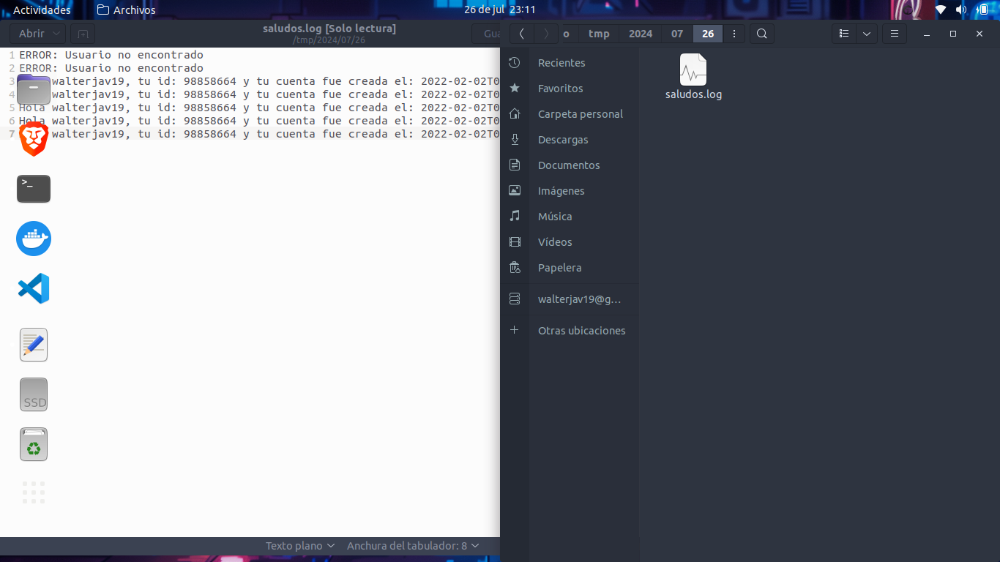

# Tarea 2

Script simple que obtiene datos de un endpoint para ejecutar un saludo y escribe logs
(Se ejecuta cada 5 minutos)

## Ejecucion Individual

Para ejecutar individualmente el script se deben de otorgar el permiso de script +x
de esta forma


```bash
chmod +x ruta/a/tu/Script.sh
```
Una vez se tengan los permisos correctos se puede ejecutar el script colocandonos en la ruta
del script y llamando al archivo ademas de pasar por parametro el nombre

```bash
cd ruta/al/sccript
./Script.sh nombre_usuario_github
```

## Ejecucion con crontab

De esta forma se estara ejecutando el script cada 5 minutos. Primero debemos de abrir el archivo
crontab

```bash
sudo crontab -e
```

lo que abrira un editor de texto que permitira agregrar las tareas a automatizar


```
*/5 * * * * /home/walter/Escritorio/2S2024/SOPES1/so1_actividades_202111718/actividad2/Script.sh nombre_del_parametro
```

esto significa que se ejecutara cada 5 segundosdurante todos los dias, meses...etc

## Visualizacion Logs

Para la Visualizacion de los logs debemos de dirigirnos a la siguiente ruta

```
/tmp/YYYY/MM/DD

```

donde la fecha se obtiene del sistema

