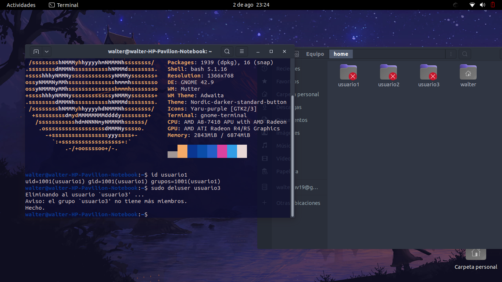

# Tarea 3

Administración de usuarios, grupos y permisos en un sistema operativo Linux.

## Parte 1: Gestión de Usuarios
1. Creación de Usuarios
```bash
adduser nombre_usuario
```


Por defecto colocamos la `password`: password1

2. Asignación de Contraseñas

```bash
passwd nombre_usuario
```
Colocamos a la `password`: password, a todos los usuarios


3. Información de Usuarios

```bash
id nombre_usuario
```


Muestra la información de `usuario1` usando el comando `id`.


4. Eliminación de Usuarios 

```bash
deluser nombre_usuario
```



Elimina `usuario3`, pero conserva su directorio principal.

## Parte 2: Gestión de Grupos

1. Creación de Grupos

```bash
addgroup nombre_grupo
```


Crea dos grupos llamados `grupo1` y `grupo2`

2. Agregar Usuarios a Grupos

```bash
adduser nombre_usuario nombre_grupo
```


Agrega `usuario1` a `grupo1` y `usuario2` a `grupo2`.

3. Verificar Membresía

```bash
group nombre_usuario
```


Verifica que los usuarios han sido agregados a los grupos utilizando el comando `groups`.

4. Eliminar Grupo

```bash
delgroup nombre_grupo
```


Elimina `grupo2`


## Parte 3: Gestión de Permisos
1. Creación de Archivos y Directorios

- Como `usuario1`, crea un archivo llamado `archivo1.txt` en su directorio principal y escribe algo en él.

```bash
su - usuario1

echo "hola mundo" >> "archivo1.txt"
```


- Crea un directorio llamado `directorio1` y dentro de ese directorio, un archivo llamado `archivo2.txt`.


```bash
su - usuario1

mkdir directorio1

touch ./directorio1/archivo2.txt
```


2. Verificar Permisos

Verifica los permisos del archivo y directorio usando el comando `ls -l` y `ls -ld` respectivamente.


```bash
ls -l

ls -ld
```


3. Modificar Permisos usando `chmod` con Modo Numérico

Cambia los permisos del `archivo1.txt` para que sólo `usuario1` pueda leer y escribir (permisos `rw-`), el grupo pueda leer (permisos `r--`) y nadie más pueda hacer nada.


```bash
chmod 640 archivo1.txt
```
- Propietario (usuario1): lectura y escritura (rw-), que corresponde a 6 (4+2).

- Grupo: lectura (r--), que corresponde a 4.

- Otros: sin permisos (---), que corresponde a 0.


4. Modificar Permisos usando `chmod` con Modo Simbólico

Agrega permiso de ejecución al propietario del `archivo2.txt`.

```bash
chmod u+x ./directorio1/archivo2.txt
```

- u: Representa al usuario (propietario) del archivo. En el contexto de chmod, u se refiere al propietario del archivo.

- +: Es el operador que se usa para agregar un permiso.

- x: Representa el permiso de ejecución.


5. Cambiar el Grupo Propietario

Cambia el grupo propietario de `archivo2.txt` a `grupo1`.

```bash
chgrp grupo1 ./directorio1/archivo2.txt
```


6. Configurar Permisos de Directorio


Cambia los permisos del `directorio1` para que sólo el propietario pueda entrar (permisos `rwx`), el grupo pueda listar contenidos pero no entrar (permisos `r--`), y otros no puedan hacer nada.


```bash
chmod 740 directorio1
```
- Propietario: rwx (lectura, escritura y ejecución), que corresponde a 7 (4+2+1).

- Grupo: r-- (solo lectura, sin permisos de ejecución), que corresponde a 4 (4+0+0).

- Otros: --- (sin permisos), que corresponde a 0.


7. Comprobación de Acceso


Intenta acceder al `archivo1.txt` y `directorio1/archivo2.txt` como `usuario2`.

```bash
su - usuario2

cat /home/usuario1/archivo1.txt

cat /home/usuario1/directorio1/archivo2.txt
```
Permiso denegado ya que tienen permisos solo para acceder en usuario1


8. Verificación Final

Verifica los permisos y propietario de los archivos y directorio nuevamente con `ls -l` y `ls -ld`.


```bash
ls -l

ls -ld
```


## Reflexion Final

- ¿Por qué es importante gestionar correctamente los usuarios y permisos en un sistema operativo?

Es importante para asegurar la privacidad y seguridad de datos, controlar el acceso a recursos, prevenir modificaciones no autorizadas, y cumplir con normativas de seguridad.


- ¿Qué otros comandos o técnicas conocen para gestionar permisos en Linux?

find con -perm para buscar archivos por permisos específicos.


