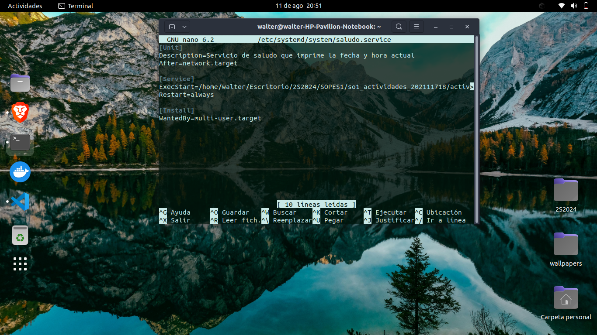
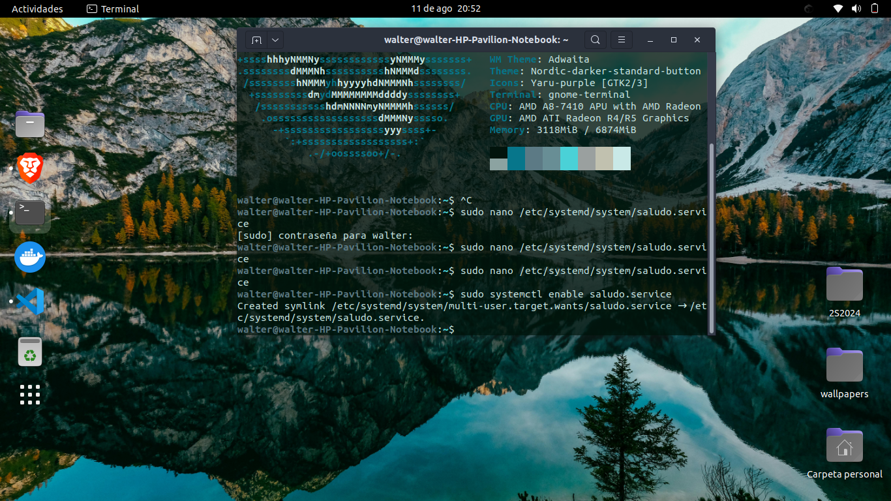
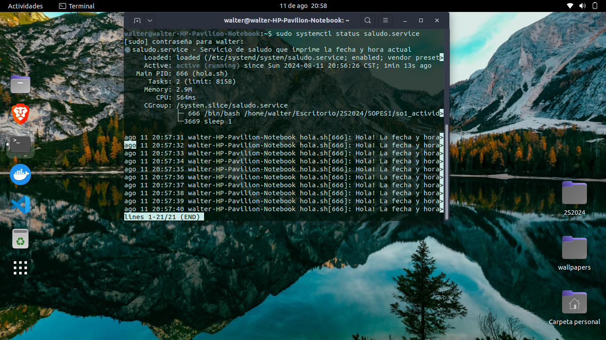
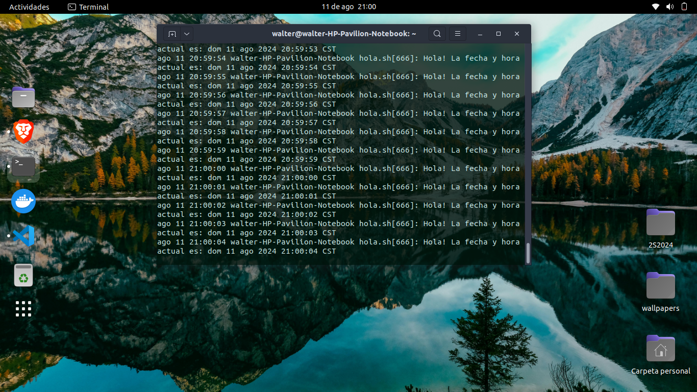
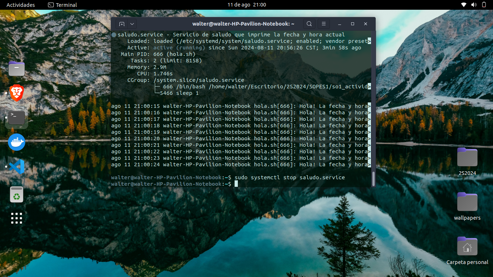
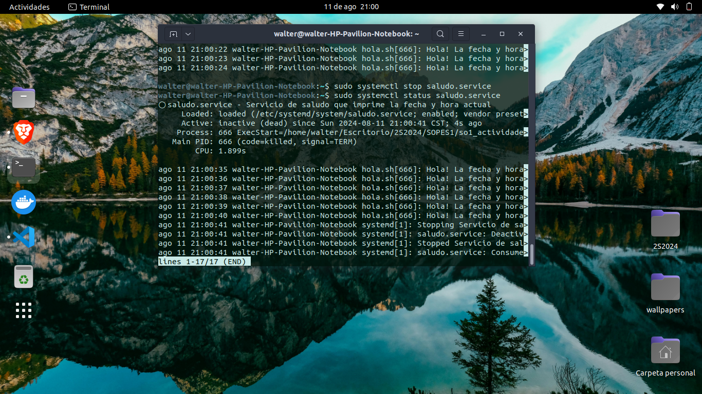

# Tarea 4
## systemd Unit
systemd es un sistema de gestión de servicios en Linux, que es responsable de iniciar, detener y supervisar servicios en el sistema.

1. Creamos un script con el saludo y fecha actual con un delay de 1 segundo
```bash
#!/bin/bash

while true
do
    echo "Hola! La fecha y hora actual es: $(date)"
    sleep 1
done
```
2. Otorgamos permisos de ejecucion al script

```bash
chmod +x ~/tu_archivo.sh
```
3. Creamos un Systemd file

```
sudo nano /etc/systemd/system/saludo.service
```



```service
[Unit]
Description=Servicio de saludo que imprime la fecha y hora actual
After=network.target

[Service]
ExecStart=/home/tu_usuario/saludo.sh
Restart=always

[Install]
WantedBy=multi-user.target
```
4. Recargamos el systemd
```bash
sudo systemctl daemon-reload
```

5. Habilitamos e Iniciamos el servicio

```bash
sudo systemctl enable saludo.service
sudo systemctl start saludo.service
```



6. verificamos status y logs en tiempo real


```bash
sudo systemctl status saludo.service #muestra estado y los logs que se generan

sudo journalctl -fu saludo.service # para solo ver los ultimos logs usar -u
```





7. [Opcional] detener el servicio



