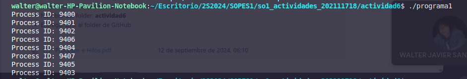
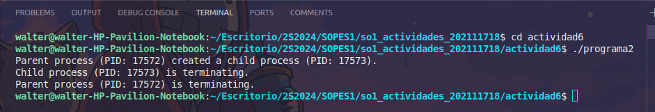
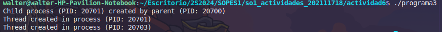

# Respuestas - Procesos e Hilos

1. 8 Procesos y la logica de la respuesta va de la siguiente forma

    - Primera llamada a `fork()`: Esto crea un nuevo proceso hijo. Ahora hay 2 procesos (el proceso main y el proceso hijo).

    - Segunda llamada a `fork()`: Ambos procesos existentes (el original y el hijo) ejecutan la siguiente llamada a `fork()`, por lo que cada uno crea un nuevo proceso. Ahora hay 4 procesos en total (2 originales + 2 nuevos hijos).

    - Tercera llamada a `fork()`: Cada uno de los 4 procesos ejecuta otro `fork()`, creando un nuevo proceso cada uno. Al final, hay 8 procesos en total (4 anteriores + 4 nuevos hijos).


2. El programa lleva la siguiente logica

```c
#include <stdio.h>
#include <unistd.h>
#include <sys/types.h>
#include <sys/wait.h>

int main() {
    pid_t pid = fork();

    if (pid < 0) {
        // Error al crear el proceso hijo
        perror("fork failed");
        return 1;
    } else if (pid == 0) {
        // Proceso hijo
        printf("Child process (PID: %d) is terminating.\n", getpid());
        _exit(0); // Termina el proceso hijo
    } else {
        // Proceso padre
        printf("Parent process (PID: %d) created a child process (PID: %d).\n", getpid(), pid);
        sleep(60); // Duerme durante 60 segundos
        printf("Parent process (PID: %d) is terminating.\n", getpid());
        wait(NULL); // Espera al proceso hijo para limpiarlo
    }

    return 0;
}
```



3. El programa completo es de la siguiente forma

```c
#include <stdio.h>
#include <stdlib.h>
#include <unistd.h>
#include <pthread.h> // Para manejar los hilos

// Función que ejecutará el hilo
void* thread_function(void* arg) {
    printf("Thread created in process (PID: %d)\n", getpid());
    return NULL;
}

int main() {
    pid_t pid;

    // Primera bifurcación (fork)
    pid = fork();
    if (pid < 0) {
        perror("Fork failed");
        exit(1);
    }

    if (pid == 0) { // Proceso hijo
        printf("Child process (PID: %d) created by parent (PID: %d)\n", getpid(), getppid());
        
        // Segunda bifurcación (fork) dentro del hijo
        fork();

        // Crear un hilo en el proceso hijo
        pthread_t thread;
        if (pthread_create(&thread, NULL, thread_function, NULL) != 0) {
            perror("Thread creation failed");
            exit(1);
        }

        // Espera a que el hilo termine
        pthread_join(thread, NULL);
    }

    // Tercera bifurcación (fork)
    fork();

    // Poner un pequeño delay para evitar que los procesos terminen muy rápido
    sleep(1);
    
    return 0;
}
```

- ¿Cuántos procesos únicos son creados?

    El programa empieza con un proceso. Con la primera llamada a `fork()`, se crean 2 procesos. Con las otras 2 llamadas a `fork()`, cada proceso adicional genera otro, lo que da un total de 8 procesos únicos (incluyendo el proceso inicial).

- ¿Cuántos hilos únicos son creados?

    Solo hay un `pthread_create` que se ejecuta en el proceso hijo de la primera bifurcación, por lo que se crea 1 hilo único.

