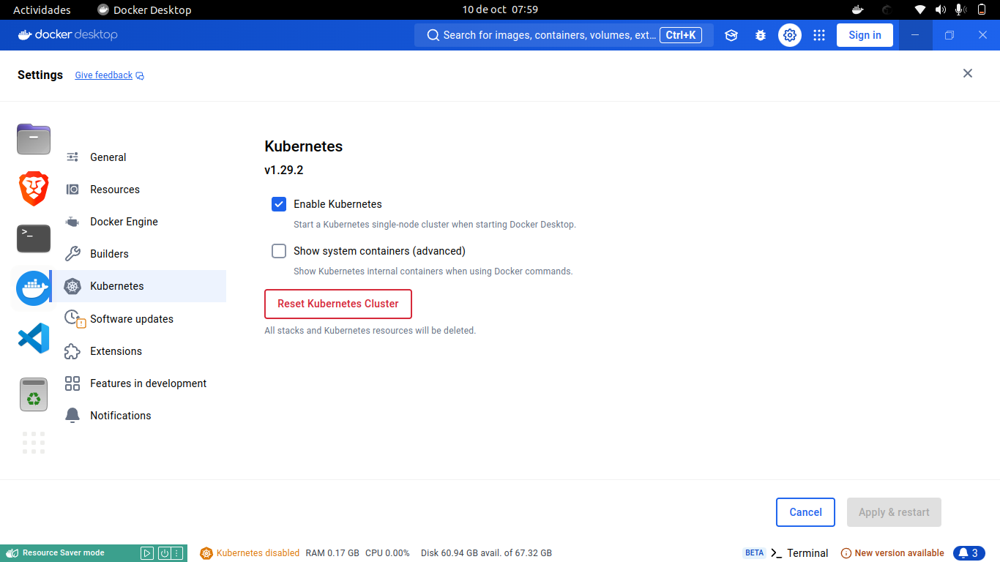
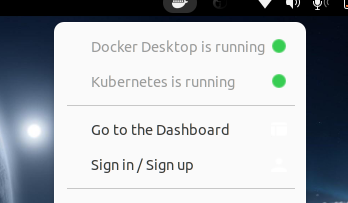
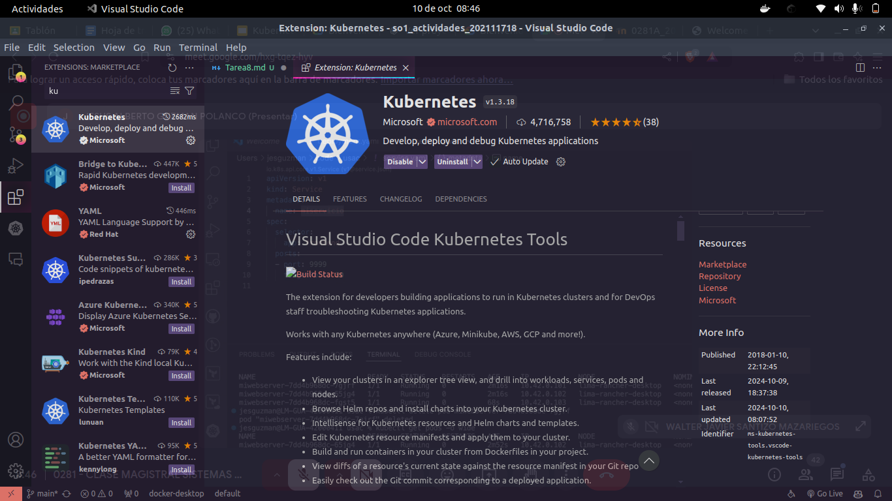
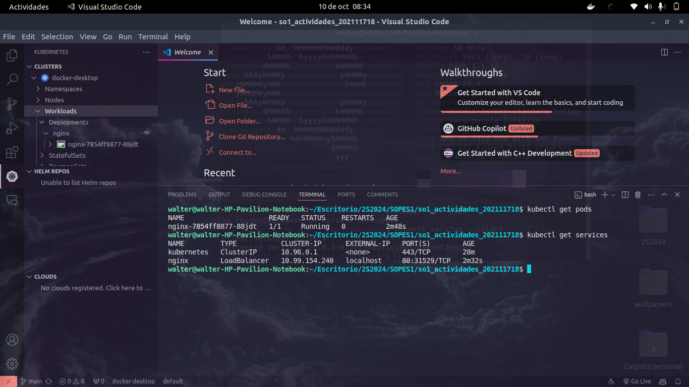
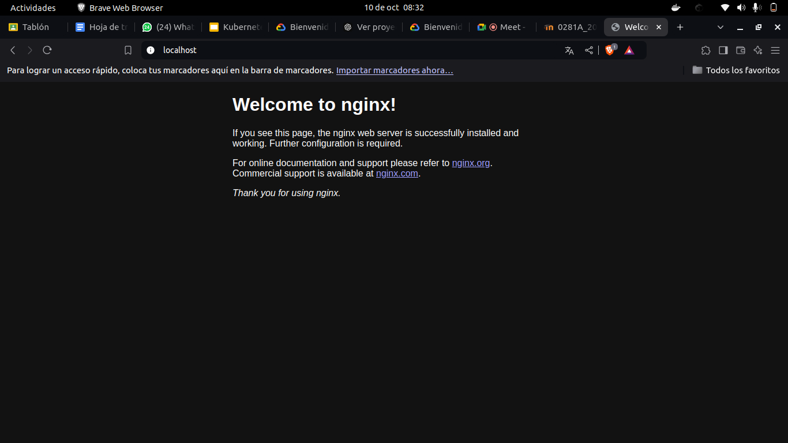
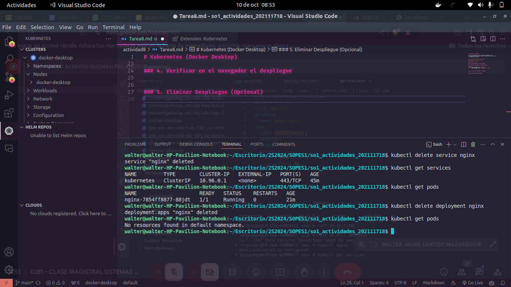

# Kubernetes (Docker Desktop)

se hara un despliegue de nginx en un cluster de kubernetes local
por lo que se mostrara de forma resumida la instalacion de un cluster local
y el despliegue del webserver


### 1. Habilitar Kubernetes en Docker Desktop





### 2. Instalar Extension de Vscode(Opcional)



### 3. Ejecutar el despliegue y el mapeo de puertos

```bash
kubectl create deployment nginx --image=nginx
kubectl expose deployment nginx --type=NodePort --port=80
```



### 4. Verificar en el navegador el despliegue



### 5. Eliminar Despliegue (Opcional)

```bash
kubectl delete service nginx
kubectl delete deployment nginx
```




**¿En un ambiente local de Kubernetes existen los nodos masters y workers, como es que esto funciona?**

En un entorno local de Kubernetes, como cuando se usa una herramienta como Minikube, kind (Kubernetes in Docker) o K3s, se simulan tanto los nodos master como los workers dentro de una sola máquina (tu computadora), pero en un entorno de Kubernetes de producción, estos nodos suelen estar distribuidos en varias máquinas físicas o virtuales.

un entorno local de Kubernetes (como Minikube o Kind), ambos tipos de nodos, master y worker, suelen estar en la misma máquina, y todo el clúster se ejecuta dentro de un contenedor o una máquina virtual.

- **Nodo Master**: Aunque en un entorno de producción tendrías nodos separados, en un entorno local, la estructura completa del nodo master (API server, etcd, scheduler, etc.) y uno o más nodos worker pueden ejecutarse en la misma máquina, en contenedores o una VM.

- **Minikube**: Ejecuta una VM local que actúa como un nodo que incluye tanto el plano de control (master) como el nodo worker.

- **Kind**: Crea contenedores Docker que simulan los nodos master y worker dentro de tu máquina.